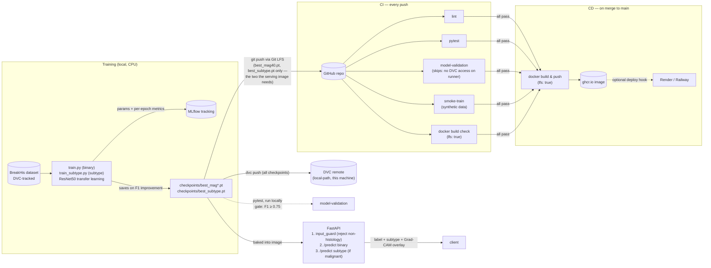

# Breast Cancer MLOps Pipeline

[](https://github.com/amarasie0602/breast-cancer-diagosis/actions/workflows/ci.yml)
[](https://github.com/amarasie0602/breast-cancer-diagosis/actions/workflows/cd.yml)

3-stage breast cancer histopathology classification pipeline trained on the
[BreakHis](https://web.inf.ufpr.br/vri/databases/breast-cancer-histopathological-database-breakhis/)
dataset, with an MLOps pipeline around it: experiment tracking, data/model
versioning, automated testing, containerized serving, and CI/CD.

1. **Image validation** — reject inputs that don't plausibly look like an
   H&E-stained histology image (photos, screenshots, unrelated images)
   before running them through a classifier that has no way to say "I
   don't recognize this."
2. **Benign vs. malignant** classification (binary).
3. **Malignant subtype** classification (Invasive Ductal Carcinoma,
   Invasive Lobular Carcinoma, Mucinous Carcinoma, or Papillary Carcinoma —
   the four subtypes BreakHis actually labels), only run when stage 2
   predicts malignant. **Currently gated off**, see below.

### Stage 3 reports no subtype, on purpose

BreakHis has 38 ductal carcinoma patients but only 5 lobular, 6 papillary
and 9 mucinous. With patient-level splits that leaves ~4 training patients
for three of the four classes, and every configuration tried — two
architectures, weighted loss vs balanced sampling, mild vs heavy
augmentation — trains to at or below the 0.25 random baseline on
validation. Unfreezing the backbone made validation *worse* while train
loss fell, i.e. it memorizes patients rather than subtypes.

So serving refuses to report a subtype unless a checkpoint clears
`MIN_SUBTYPE_MACRO_F1` (default 0.55). Below that, `/predict` returns the
benign/malignant result plus a `subtype_unavailable_reason` explaining
why, rather than presenting a coin toss as a prediction. The measured
numbers are in [docs/model_card.md](docs/model_card.md#limitations).

A learnable version of this stage would be a coarser question with enough
patients behind it — ductal (38 patients) vs all other malignant subtypes
(20) — rather than the 4-way split.

"Benign" means non-cancerous tumor, not healthy tissue — BreakHis contains
no normal/healthy tissue images at all, only benign and malignant tumor
specimens. See [docs/model_card.md](docs/model_card.md) for why, and for
what the dataset does and doesn't support.

BreakHis provides each sample at four magnification levels (40x, 100x, 200x,
400x). The binary classifier is evaluated per-magnification to compare how
classification performance varies with zoom level; the subtype classifier is
trained on all magnifications combined (see model card for why).

## Stack

- PyTorch (transfer learning backbone), Grad-CAM for explainability
- MLflow for experiment tracking
- DVC for dataset/model versioning
- pytest for testing
- FastAPI + Docker for serving
- GitHub Actions for CI/CD

## Architecture

The checkpoint that gets served is the same artifact the model-validation
gate checks locally before a push — there is no separate "production
model" step:



The model-validation gate is real and does enforce a minimum F1 — but
today only where the checkpoint is actually reachable (locally, or
anywhere with `dvc pull` access to the remote). The GitHub Actions runner
has no credentials for this project's local-path DVC remote, so its copy
of that job still skips; wiring a cloud DVC remote (S3/GCS) would close
that gap.

```
data/BreaKHis_v1/          Raw dataset (DVC-tracked, not in Git)
src/
  data/                    Dataset loaders (binary + subtype), patient-level splits, augmentation, EDA helpers
  models/                  ResNet50 transfer-learning classifiers (binary + subtype)
  training/                Train/eval loops (binary + subtype), metrics, checkpointing, MLflow logging, CLIs
  explainability/          Grad-CAM, overlay rendering, MLflow artifact logging
  serving/                 FastAPI app: input_guard (stage 1), /predict (stages 2-3), static web UI
tests/                     pytest suite (unit + integration + model validation gate)
configs/                   YAML configs for data splits and training hyperparameters
notebooks/                 EDA, error analysis
docs/                      Model card, exported charts
.github/workflows/         CI (lint, test, model-validation, smoke-train, Docker build) and CD
```

## Setup

```bash
python -m venv .venv
.venv/Scripts/activate  # Windows; use `source .venv/bin/activate` on macOS/Linux
pip install -r requirements.txt

# Place the BreakHis dataset at data/BreaKHis_v1/ (see data/README.md)

pytest -q                        # run the test suite
python -m src.training.train --data-root data/BreaKHis_v1 --magnification 40
python -m src.training.train_subtype --data-root data/BreaKHis_v1  # malignant subtype
python -m src.training.compare_runs   # compare val F1 across magnifications
uvicorn src.serving.app:app --reload  # run the API + web UI locally
```

Or via Docker:

```bash
docker compose up --build
```

## Results

Per-magnification comparison — the project's headline finding. ResNet50,
transfer learning, patient-level 70/15/15 split, held-out **test** set
(never used for training or checkpoint selection):

| Magnification | F1 | Accuracy | Precision | Sensitivity | Specificity |
| -------------- | ---- | -------- | --------- | ----------- | ----------- |
| 200x           | 0.952 | 0.925   | 0.916     | 0.990       | 0.732       |
| 40x            | 0.901 | 0.848   | 0.838     | 0.974       | 0.544       |
| 400x           | 0.882 | 0.819   | 0.796     | 0.988       | 0.461       |
| 100x           | 0.861 | 0.796   | 0.841     | 0.882       | 0.575       |

Regenerate with `python -m scripts.evaluate_test_set --magnification 40`.

**Read the specificity column before the F1 column.** The model catches
nearly every malignant case (sensitivity 0.88-0.99) but misclassifies
roughly half of benign tissue as malignant — at 400x, 41 of 76 benign
images. F1 looks strong only because it is computed on the malignant
class, and malignant outnumbers benign about 2:1 in the test set, so a
model that over-calls cancer is rewarded twice. The bias is the safer
direction for screening, but it is not "the model works."

The per-magnification ranking is also noisy — it flips between validation
and test, since each split has only 11 test patients. See
[docs/model_card.md](docs/model_card.md#results) for the confusion
matrices and the full discussion.

## CI/CD

**CI** (`.github/workflows/ci.yml`) runs on every push/PR: lint (ruff),
the full pytest suite, a model-validation job that gates on minimum F1
(skips gracefully if no checkpoint is present, but runs for real and
enforces the threshold once one exists — see Results below), a smoke-train
job that runs the actual training CLI end-to-end on a tiny synthetic
dataset, and a Docker build check to catch container-breaking changes
before merge.

**CD** (`.github/workflows/cd.yml`) builds the serving image and pushes it to
GitHub Container Registry (`ghcr.io/<owner>/breast-cancer-classifier`) on
merge to `main` — no external account needed. The final deploy step is
gated on an optional `DEPLOY_HOOK_URL` repository secret; add a deploy-hook
URL from Render, Railway, or a similar free-tier host to enable automatic
deployment. Without it, the step is a no-op and the image can still be run
locally with `docker compose up --build` or `docker run` against the
pushed ghcr.io image.

## Limitations

See [docs/model_card.md](docs/model_card.md) for the full breakdown. In
short: this is a coursework/portfolio project, not a clinical tool — trained
on a small single-institution dataset (82 patients), with known class and
subtype imbalance, and no external validation. Grad-CAM overlays are
illustrative, not proof the model attends to clinically meaningful features.
